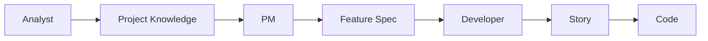
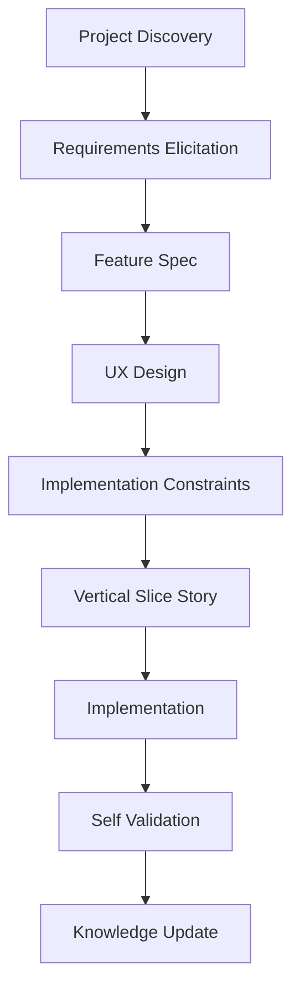

## BMAD를 배우려다 AI Software Engineering을 배우게 되었다

최근 **Spec-Driven Development(SDD)** 를 공부하기 시작했다.
처음에는 단순히 요즘 많이 이야기하는 **BMAD Method** 사용법을 익히려고 했다.

그런데 BMAD를 하나씩 뜯어보면서 오히려 깨달은 것은,

> **BMAD는 하나의 도구가 아니라 AI 시대의 Software Engineering을 배우기 위한 훌륭한 교재라는 점이었다.**

---

## 처음에는 BMAD Method 사용법을 배우려고 했다

처음 BMAD를 접하면 `Analyst → PM → Architect → Developer` 라는 구조를 만나게 된다.
그리고 자연스럽게 이런 의문이 생긴다.

> "Analyst는 뭘 하지?"
> "PM은 왜 필요하지?"
> "Story는 왜 만드는 거지?"

나 역시 처음에는 **Agent를 사용하는 방법** 을 배우려고 했다.
하지만 며칠 동안 실제 프로젝트에 적용해보니 질문이 조금씩 바뀌기 시작했다.

---

## BMAD의 핵심은 Agent가 아니었다

처음에는 `Agent → Skill → Command` 가 BMAD의 핵심인 줄 알았다.
하지만 실제로는 아니었다. BMAD의 핵심은 `Role → Context → Artifact` 였다.

각 Agent는

- 자신만의 역할(Role)
- 자신만의 Context
- 자신만의 산출물(Artifact)

을 가진다. 예를 들면 이런 흐름이다.



이렇게 산출물이 다음 역할의 입력이 된다.

---

## Brownfield 프로젝트에서는 Analyst의 역할이 달랐다

새로운 프로젝트에 투입되면 내가 가장 먼저 하는 일은 무엇일까?
거의 항상 `기존 소스 분석 → 업무 분석 → 기술 분석` 이었다.

처음에는 Analyst가 Business만 담당한다고 생각했지만 Brownfield에서는 그렇지 않았다.
Analyst는 기존 시스템을 리버싱하면서 업무와 기술을 동시에 이해하는 역할이었다.

예를 들면 다음과 같은 문서를 만들어 프로젝트의 지식을 축적한다.

```
docs/project-knowledge/
  ├─ business-domain.md
  ├─ technical-stack.md
  ├─ coding-patterns.md
  ├─ ui-patterns.md
  └─ project-context.md
```

---

## PM은 문서를 작성하는 사람이 아니었다

처음에는 PM이 Spec만 작성하는 사람인 줄 알았다.
하지만 실제 PM의 역할은 Spec을 작성하는 것이 아니라 **요구사항을 이끌어내는 것(Requirements Elicitation)** 이었다.

예를 들어 "신규 화면을 만들고 싶다" 라고 말하면 바로 Spec을 작성하는 것이 아니라 다음과 같이 질문을 통해 요구사항을 구체화한다.

> - 이 화면의 목적은 무엇인가요?
> - 누가 사용하는 화면인가요?
> - 기존 화면을 참고하나요?
> - 조회만 하나요?
> - 등록도 하나요?

Spec은 질문이 끝난 뒤에 만들어지는 결과물이다.

---

## Story의 의미를 이해하게 되었다

처음에는 Story가 왜 필요한지 이해되지 않았다.
하지만 조금 지나니 Spec과 Story는 완전히 다른 문서라는 것을 알게 되었다.

- **Feature Spec** 은 "무엇을 만들 것인가?" 를 설명하는 문서이다.
- **Story** 는 "어떻게 구현할 것인가?" 를 설명하는 엔지니어링 문서이다.

즉 `Spec → Story → Code` 라는 흐름이 된다.

---

## Vertical Slice가 더 중요했다

처음에는 Story를 `Frontend / Backend / DB` 처럼 레이어로 나누려고 생각했다.
하지만 실제로는 Vertical Slice가 훨씬 적합했다.

예를 들면 한 Story가 다음과 같이 구성된다.

```
Story 1: 검색조건 1개
  API → SQL → 화면 표시
```

사용자가 실제로 동작을 확인할 수 있는 End-to-End 단위로 나누는 것이다.
이 방식은 MVP와도 비슷하지만 조금 더 작은 **Walking Skeleton** 에 가깝다.

---

## Project Knowledge와 Context Engineering

BMAD를 공부하면서 가장 흥미로웠던 부분은 Context Engineering이었다.
처음에는 Project Knowledge, Persistent Facts, AGENTS.md 가 모두 같은 개념인 줄 알았다.
하지만 역할은 조금 달랐다.

### Project Knowledge

프로젝트에 대한 지식 자체이다. 예를 들면 업무 도메인, 기술 스택, UI 패턴, 코딩 규칙 등이 들어간다.

### Persistent Facts

Agent가 항상 읽어야 하는 Context를 정의한다.
예를 들어 Developer는 `project-context.md`, `coding-rules.md`, `libraries.md` 를 항상 읽는다.
PM은 Business 문서만 읽을 수도 있다.

### AGENTS.md

AGENTS.md는 프로젝트 전체의 AI 사용 규칙을 설명하는 문서라고 생각하는 것이 가장 자연스럽다.
예를 들면 다음 정도만 적어도 충분하다.

- 이 프로젝트는 BMAD 기반이다.
- Project Knowledge 위치
- 권장 Workflow

---

## BMAD의 진짜 장점

며칠 동안 사용하면서 느낀 것은, BMAD의 장점은 Skill이 아니었다.
오히려 다음 세 가지였다.

- **Role Separation**
- **Context Separation**
- **Artifact Separation**

각 역할이 어떤 문서를 입력으로 받고 어떤 문서를 출력하는지가 명확하다.
이것이 BMAD의 가장 큰 가치라고 느꼈다.

---

## 결국 중요한 것은 Workflow였다

흥미로운 점은 BMAD는 Workflow를 강제하지 않는다는 것이다. 오케스트레이터는 사용자 자신이다.

즉 `Analyst → PM → Developer` 를 사용할 수도 있고, `Analyst → PM → UX → Developer` 를 사용할 수도 있다.
심지어 전혀 다른 Workflow를 만들어도 된다.

---

## 내가 정리한 Brownfield Workflow

현재 내가 생각하는 Brownfield 프로젝트 Workflow는 다음과 같다.



이 Workflow는 BMAD를 사용해도 되고, BMAD 없이 여러 Chat Session으로도 동일하게 구현할 수 있다.

---

## 앞으로의 AI Software Engineering

처음에는 BMAD를 배우려고 시작했지만 결국 배우게 된 것은 AI 시대의 Software Engineering이었다.

예전 개발 사이클이 `Requirement → Design → Implementation → Test` 였다면, 앞으로는 다음 흐름이 하나의 개발 사이클이 될 것이라고 생각한다.

`Project Knowledge → Requirements Elicitation → Feature Spec → Planning → Implementation → Knowledge Update`

그리고 BMAD는 이런 사고방식을 배우기에 매우 좋은 프레임워크였다.

---

## 정리

이번에 BMAD를 공부하면서 얻은 가장 큰 깨달음은 다음과 같다.

> **BMAD를 배우는 것이 목적이 아니라, AI와 함께 일하는 Software Engineering을 배우는 것이 목적이라는 점이다.**

앞으로는 다음 주제들을 중심으로 나만의 개발 방법론을 계속 다듬어 볼 생각이다.

- Spec-Driven Development
- Context Engineering
- Multi-Agent Workflow
- Brownfield AI Development
